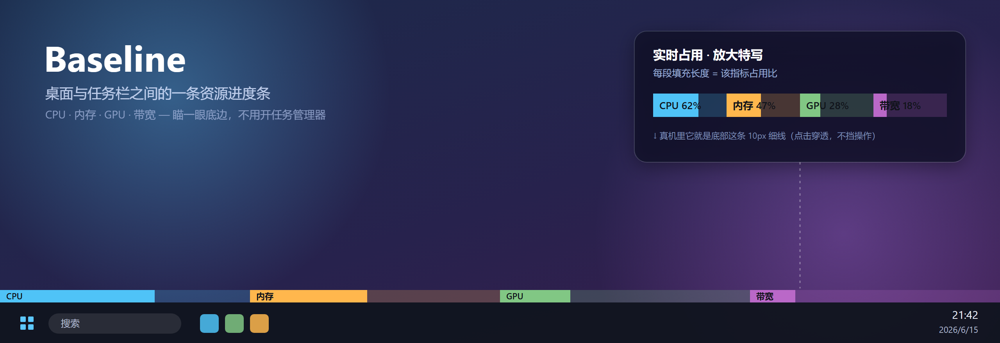
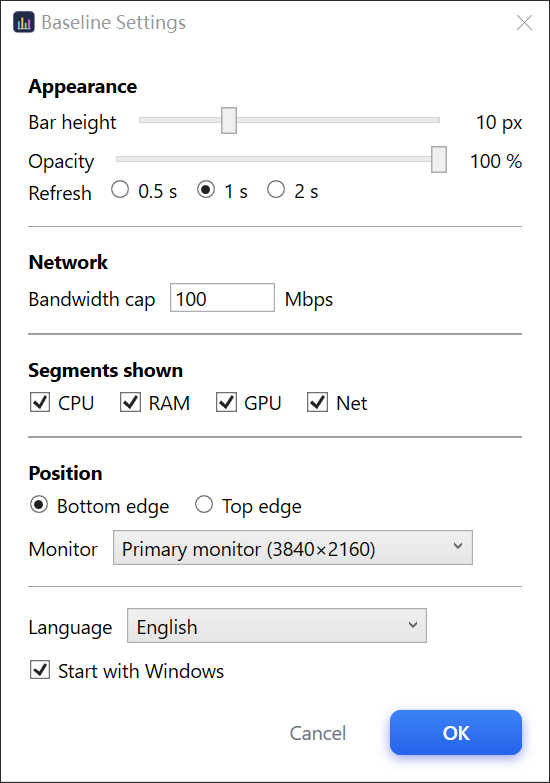
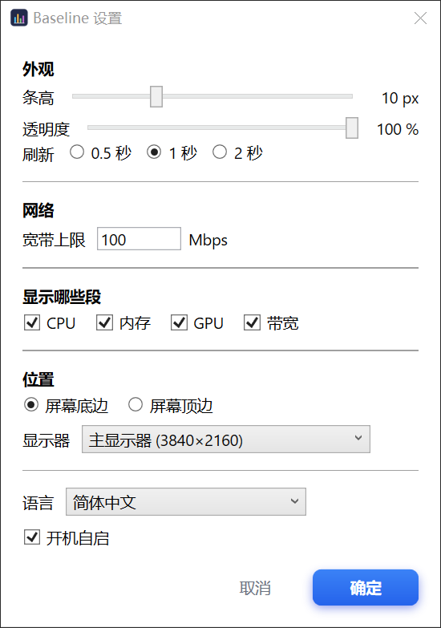
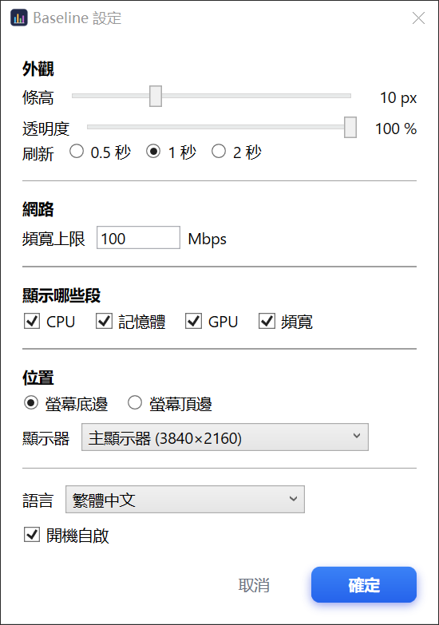
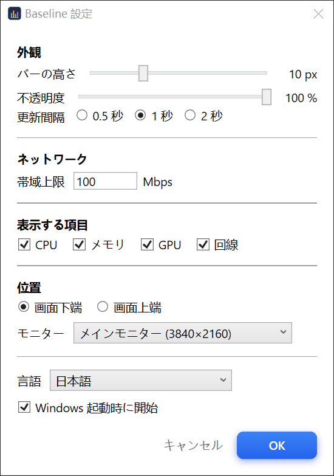
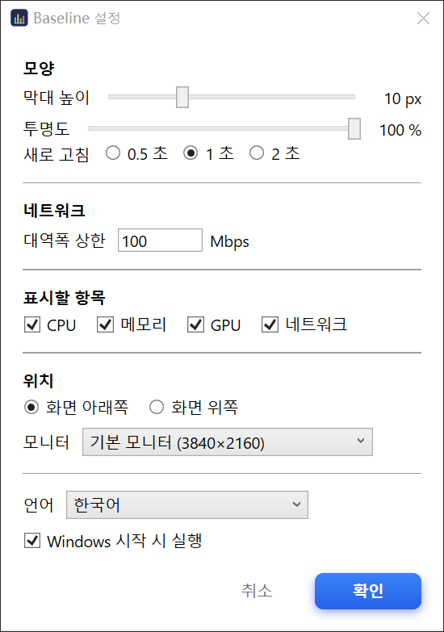
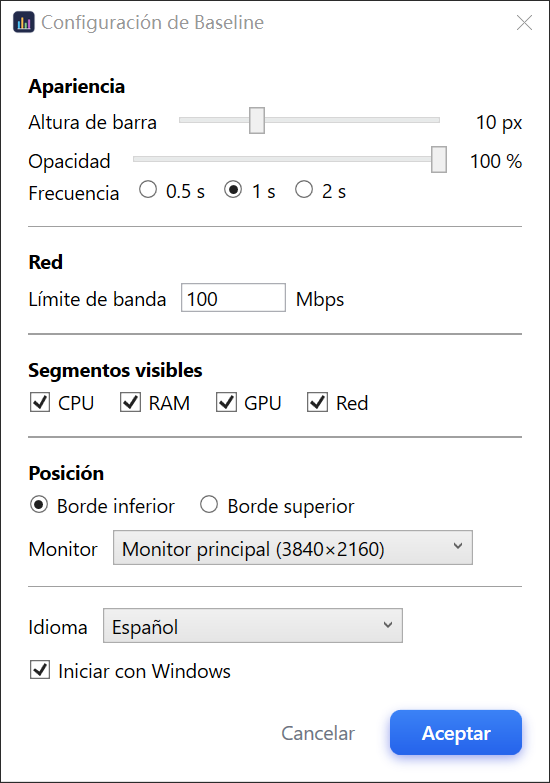
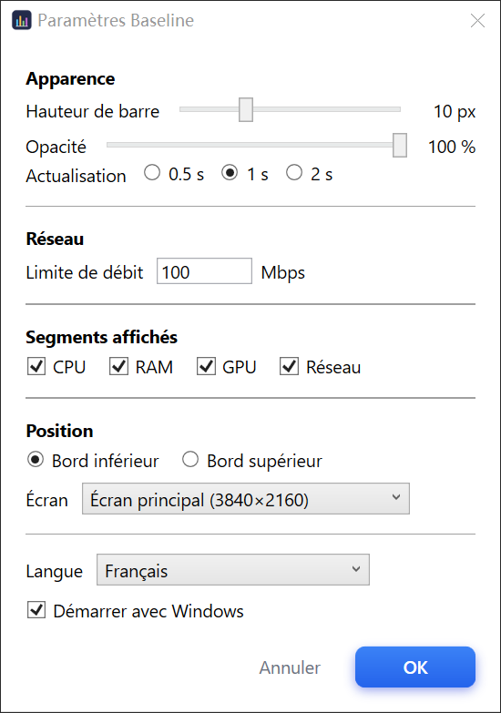
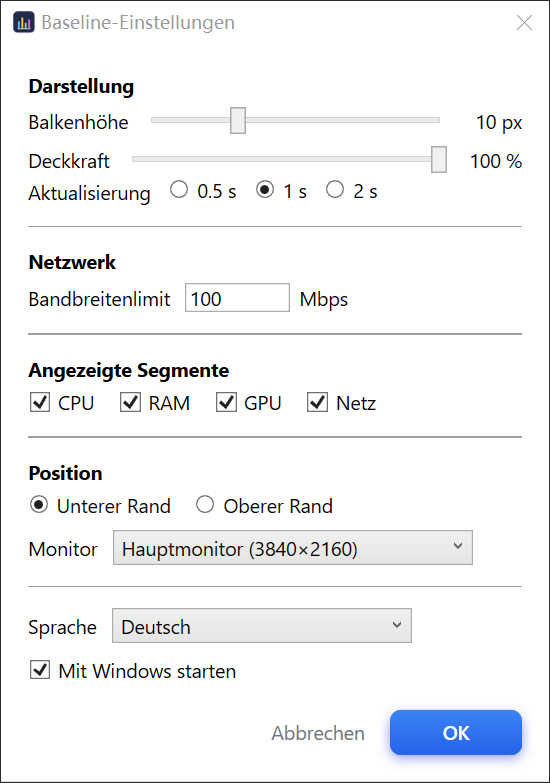
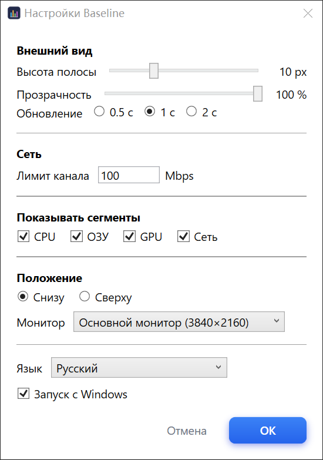

# Baseline

**English** | [简体中文](README.zh-CN.md)



A thin, always-on-top progress bar pinned to the bottom edge of your screen — right above the taskbar. It shows live system resource usage at a glance, so you never have to open Task Manager.

Four segments, left to right: **CPU / RAM / GPU / Network**. Each segment fills in proportion to its usage. The bar is click-through (clicks pass to whatever is behind it) and never steals focus.

## Features
- Live **CPU / RAM / GPU / Network** usage as a segmented bar
- **Hover** over a segment to show its exact value inline — the Network segment shows live download speed (e.g. `4.2 MB/s`), the rest show usage percentage
- **10 languages**, following your system language by default (see [Languages](#languages))
- **Settings window** (tray → Settings): bar height, opacity, refresh rate, bandwidth, which segments to show, screen edge / monitor, language, autostart — saved to `%AppData%\Baseline\settings.json`
- Click-through & always-on-top; lives in the system tray
- Resolution / DPI aware (WPF DIP + PerMonitorV2)

## Settings
Open it from the tray icon → **Settings** (or run `Baseline.exe --open-settings`).



## Download
Grab the latest build from [Releases](https://github.com/frozentearz/Baseline/releases/latest):
- **`Baseline.exe`** (~73 MB, recommended) — self-contained, just download and run. No .NET install required.
- **framework-dependent zip** (~3.5 MB) — smaller, but requires the [.NET 10 Desktop Runtime](https://dotnet.microsoft.com/download/dotnet/10.0); unzip and run `Baseline.exe`.

Exit via the tray icon → Exit.

## Build from source
```powershell
dotnet run --project src/Baseline
```
Requires the .NET 10 SDK. Tech stack: C# + WPF; hardware data via `LibreHardwareMonitorLib`.

## Languages
Baseline ships with 10 languages and picks your Windows display language on first run; change it anytime in the Settings window.

English · 简体中文 · 繁體中文 · 日本語 · 한국어 · Español · Français · Deutsch · Русский · Português

<details>
<summary>Screenshots in every language</summary>

| | | |
|---|---|---|
|  |  |  |
|  |  |  |
|  |  |  |
|  | | |

</details>

## Notes
- The Network segment is full at **50 Mbps** (≈ 6.25 MB/s download) by default — adjust it in the Settings window (it only counts **download** on the busiest adapter, so a VPN's virtual adapter won't double-count).
- If the GPU segment stays at 0, it's usually a permissions issue — run as administrator.
- Colors and the segment layout live in `Config/Settings.cs`; UI strings live in `Config/Loc.cs`.

See [CLAUDE.md](CLAUDE.md) for project conventions (Chinese).
